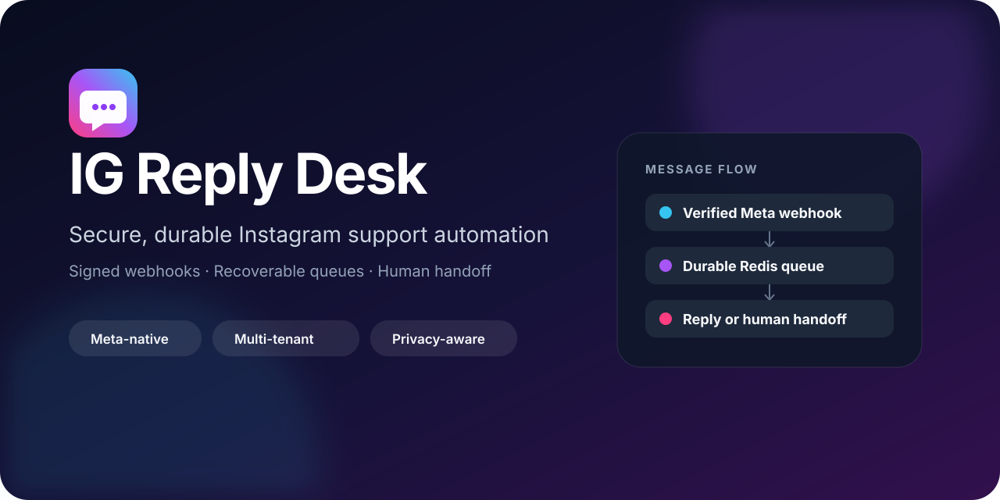
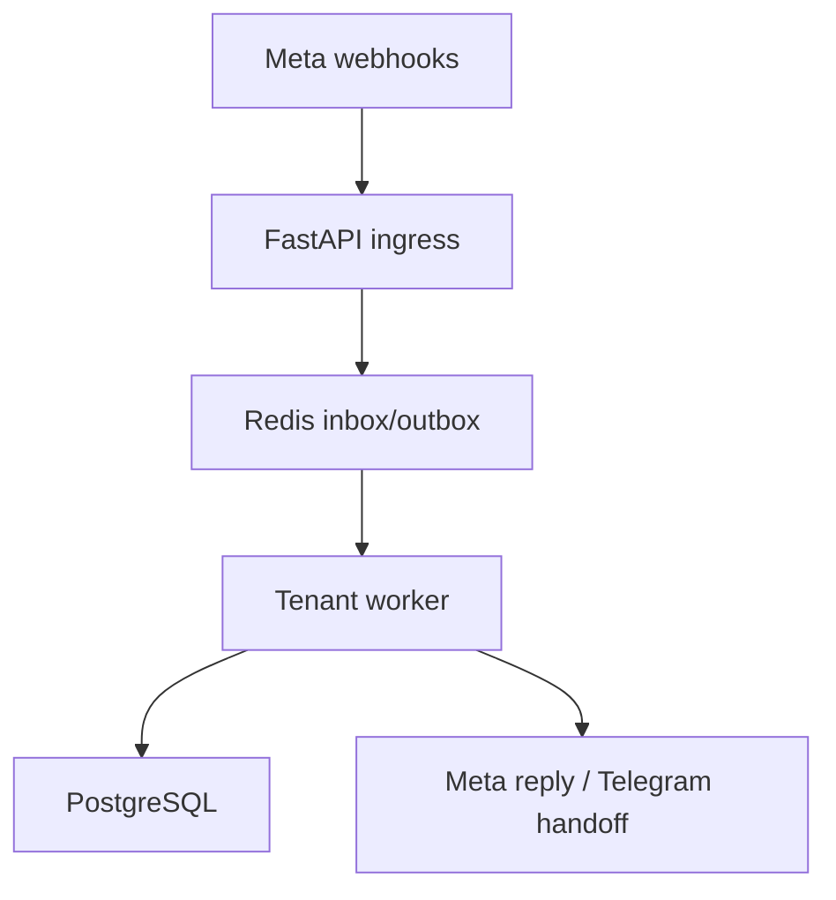

<p align="center">
  
</p>

<p align="center">
  <a href="https://github.com/imedkablavi/insta_ai_res/actions/workflows/ci.yml"></a>
  
  
  
</p>

<p align="center">
  An inbound Instagram support desk with signed Meta webhooks, tenant-scoped automation,
  recoverable Redis queues, business hours, and Telegram human handoff.
</p>

> [!IMPORTANT]
> The security and reliability controls are implemented and locally tested, but a real Meta test-account matrix is still a production gate. See [what is proven](docs/META_NATIVE_TEST_REPORT.md) and [what remains](ROADMAP.md).

## Why IG Reply Desk?

Most webhook demos stop after “receive JSON and send a reply.” IG Reply Desk focuses on what happens in production: forged requests, duplicate deliveries, dependency outages, queue recovery, tenant boundaries, messaging-window policy, operator handoff, and privacy-safe diagnostics.

It is intentionally built for **user-initiated support**, not unsolicited broadcasts.

## Highlights

| Area | What is included |
|---|---|
| Meta-native messaging | DMs, Quick Replies, Ice Breakers/Persistent Menu postbacks, and one-time comment Private Replies |
| Arabic automation | Normalized exact, keyword, and fallback rules with reply-safety heuristics |
| Human handoff | Telegram alerts, live replies, human mode, role checks, and tenant scoping |
| Business hours | Per-account IANA timezone, weekdays, overnight shifts, and an atomic six-hour notice cooldown |
| Reliable delivery | Durable Redis inbox/outbox, leases, bounded retries, crash recovery, backpressure, and dead letters |
| Security | Meta HMAC verification before processing, replay protection, `/ops/*` auth, rate limits, secret rotation, and redacted JSON logs |
| Operations | Liveness/readiness probes, dependency-aware workers, production Docker reference, runbook, and queue telemetry |
| Quality | Fast local suite plus a real-Redis atomicity test in CI and a production-image build gate |

### A note about “AI”

The current reply engine is deterministic. It normalizes Arabic and evaluates configured rules and safety policies; it does **not** call an LLM or claim generative-AI behavior. Grounded AI is a roadmap item only after evaluation, privacy, prompt-injection, and human-fallback controls exist.

## Architecture



Request processing is at-least-once:

1. Bound the body and pre-authentication work.
2. Verify `X-Hub-Signature-256` over the raw body.
3. Atomically deduplicate and accept the delivery into Redis.
4. Resolve the tenant and claim each event with a processing lease.
5. Apply business-hours, user/account, reply, and messaging-window policies.
6. Lease outbound work until Meta accepts it or retries end in a tenant dead-letter queue.

## Quick start

Requirements: Python 3.12, PostgreSQL, Redis, and Meta/Telegram test credentials.

```bash
git clone https://github.com/imedkablavi/insta_ai_res.git
cd insta_ai_res

python -m venv .venv
. .venv/bin/activate
python -m pip install -r requirements-dev.txt
cp .env.example .env

PYTHONPATH=. pytest -q
uvicorn app.main:app --reload
```

Use `ENV=development` locally. Production mode rejects short and documented placeholder credentials. `DB_AUTO_CREATE_SCHEMA=true` is only for an empty local development database; production schema changes must be migration-owned.

## Meta configuration checklist

- Configure the HTTPS callback at `/instagram/webhook`.
- Set an independent `META_VERIFY_TOKEN` and current `META_APP_SECRET`.
- Subscribe the test app/account to the message, messaging-postback, and comment events required by the enabled features.
- Pin `META_GRAPH_API_VERSION` and test every upgrade before rollout. The default is `v26.0`; the previous hard-coded `v19.0` expired in May 2026.
- Run the [manual Meta sandbox matrix](docs/META_NATIVE_TEST_REPORT.md) before enabling a production account.

Comment automation uses Meta's one-time Private Reply addressed to `comment_id`; a public comment is never treated as permission to open an ordinary DM window.

## Telegram operator experience

Authorized owners/managers can:

- manage exact, keyword, fallback, and comment-private-reply rules;
- customize welcome, fallback, and after-hours text;
- configure timezone-aware business hours;
- receive live-chat notifications and take over conversations;
- inspect coarse diagnostics without exposing webhook bodies or credentials.

Business-hours input example:

```text
Europe/Istanbul 0,1,2,3,4 09:00 18:00
```

Days use `0=Monday` through `6=Sunday`. A close time earlier than open is an overnight shift.

## Production deployment

Generate independent random values for PostgreSQL, Redis, application encryption, Meta verification, and operations authentication. Use a URL-safe Redis password because the Compose reference injects it into `REDIS_URL`.

```bash
docker compose -f docker-compose.prod.yml config
docker compose -f docker-compose.prod.yml build --pull
docker compose -f docker-compose.prod.yml up -d
```

The reference binds the app to loopback. Terminate TLS at a trusted reverse proxy, preserve the intended source address, enforce matching edge body/rate limits, and expose only the application port. Do not place untrusted workloads on the internal data network.

Redis must use AOF persistence and `noeviction`. At-least-once delivery still has one residual edge: a worker crash after Meta accepts a send but before local acknowledgement can duplicate an external effect.

## Endpoints

| Endpoint | Access | Purpose |
|---|---|---|
| `GET /health/live` | Probe | Process liveness only |
| `GET /health/ready` | Probe | Coarse PostgreSQL/Redis readiness |
| `GET /instagram/webhook` | Public, limited | Meta subscription challenge |
| `POST /instagram/webhook` | Meta-signed, limited | Durable webhook acceptance |
| `GET /ops/status` | Operator bearer token | Queue, worker, and traffic status |
| `GET /terms`, `GET /privacy` | Public, limited | Legal information |

Use `Authorization: Bearer $OPS_API_TOKEN` for operations. `X-Ops-Token` remains available for systems that cannot set bearer authentication.

## Verification

```bash
python -m compileall -q app tests
PYTHONPATH=. pytest -q
python -m pip check
```

The default suite uses synthetic payloads and mocked external boundaries. CI additionally runs the Redis Lua atomicity contract against an isolated Redis service and builds the production image.

## Documentation

- [Roadmap](ROADMAP.md)
- [Operations runbook](RUNBOOK.md)
- [Threat model](docs/THREAT_MODEL.md)
- [Security integration report](docs/INTEGRATION_TEST_REPORT.md)
- [Meta-native test report](docs/META_NATIVE_TEST_REPORT.md)
- [Product gap analysis](docs/PRODUCT_GAP_ANALYSIS.md)
- [Security policy](SECURITY.md)
- [Contributing](CONTRIBUTING.md)

## Known production gates

- Real Meta sandbox verification and app review/permissions.
- Meta user-data deletion callback and auditable deletion lifecycle.
- Instagram Login OAuth onboarding and reauthorization UX.
- Real Alembic revisions with upgrade and rollback tests.
- Staging exercises for Redis AOF recovery, PostgreSQL outage, and process-kill recovery.
- A shared web inbox if the project expands beyond Telegram-based operations.

## Contributing and responsible use

Issues and PRs are welcome for reliable, privacy-conscious inbound support features. Read [CONTRIBUTING.md](CONTRIBUTING.md) first and report vulnerabilities privately through [SECURITY.md](SECURITY.md).

Operate only accounts you are authorized to manage and follow Meta platform policies. This project does not provide bulk messaging, authentication bypass, DRM/circumvention, or private-data scraping.

## License

No open-source license has been selected yet. Until the maintainer chooses one, source visibility does not grant reuse, modification, or redistribution rights.

---

<sub>IG Reply Desk is an independent project and is not affiliated with or endorsed by Meta.</sub>
